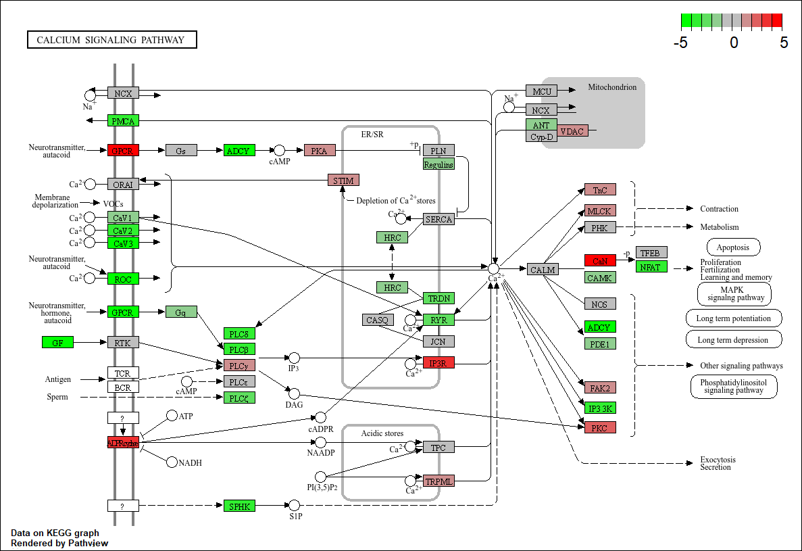

# Calciumsignaling en Osteoclast Differentiation als Drijvende Krachten van Boterosie in Reumatoïde Artritis: een transcriptomics analyse
## 📁 Inhoud/structuur
- `assets` - Overige documenten voor de opmaak van deze pagina.
- `bronnen` - Gebruikte bronnen en AI gebruik.
- `data_processed` – Bewerkte data voor helder overzicht van resultaten en uitvoeren van analyses. 
- `data_raw` – Ruwe data afkomstig van 8 individuen, waarvan 4 RA hebben, en 4 gezond zijn.  
- `data_stewardship` - Aantoning van de competentie Beheren niveau I.
- `scripts` – Scripts waarin de data geanalyseerd wordt.
- `resultaten` - Figuren zoals grafieken en tabellen.
- `README.md` - Het document om de tekst hier te genereren.

---

## Inleiding

Reumatoïde artritis (RA) is een veelvoorkomende autoimmuunziekte. In 2024 waren er zo’n 200.000 Nederlanders met deze aandoening [(Reumatoïde artritis (RA) | Leeftijd en geslacht | Volksgezondheid en Zorg, z.d.)](<https://www.vzinfo.nl/reumatoide-artritis-ra/leeftijd-en-geslacht>). RA wordt gekenmerkt door synoviale hyperplasie met pannusvorming [(Chetina & Markova, 2019)](<https://doi.org/10.1134/S1990750819010049>). Synovium, een type slijmvlies raakt ontstoken, wat lijdt tot de erosie van bot- en kraakbeenweefsel wegens overname van pannusweefsel [(Gravallese & Monach, 2015)](<https://doi.org/10.1016/B978-0-323-09138-1.00094-2>). Momenteel focust onderzoek zich op de genen die met T-cellen te maken hebben. [(Padyukov, 2022)](<https://doi.org/10.1007/s00281-022-00912-0>). Er zijn al kleine klinische studies bezig met een mogelijk geneesmiddel, CAR T-celtherapie, wat veelbelovende behandelingsresultaten bied voor diverse autoimmuunziekten, waaronder RA [(Freeley, 2025)](<https://doi.org/10.1007/s12016-025-09113-7>). 

Transcriptomics is een veelgebruikte studie binnen genetisch en medisch onderzoek. Het transcriptoom, wat hierbij onderzocht wordt, geeft informatie over hoeveelheid expressie in alle genen. Met analyses van de functies van genen met hoge expressie, kan een beeld worden geschetst van de basale processen die plaatsvinden bij zieke individuen, in vergelijking met gezonde personen [(Monzó et al., 2025)](<https://doi.org/10.1038/s41576-025-00828-z>).

In dit onderzoek is ingedoken op de processen betrokken bij RA, door transcriptiefactoren te onderzoeken aan de hand van een VolcanoPlot, GO-analyse en KEGG-pathway analyse. De nadruk is gelegd op genen en gene ontologies waar minder onderzoek naar gedaan is om een dieper begrip te krijgen van alle processen en pathways die betrokken zijn bij RA.
## Methoden

Er is ingezoomd op de transcriptomics van RA, om genen op te sporen met onderzoekspotentie [(figuur 1)](assets/Flowchart_Methode_RA.png). De dataset is afkomstig van het onderzoek van [Platzer et al. (2019)](<https://doi.org/10.1371/journal.pone.0219698>) (zie tabel 1), en is uitgewerkt in R V4.5.2 in dit [script](scripts/script_casus_transcriptomics_RA.R).

*Tabel 1. Patiënten uit onderzochte dataset, afkomstig van het onderzoek van [Platzer et al. (2019)](<https://doi.org/10.1371/journal.pone.0219698>). De ruwe sequencing data in FASTQ bestanden is afkomstig van 8 vrouwen, 4 met RA (leeftijden 54-66), vastgesteld voor >12 maanden en positief getest op autoantistoffen ACPA. En een negatief geteste controlegroep van 4 (leeftijden 15-42).*
|     ID      | Age |   Sex   |               Status                |
| ----------- | --- | ------- | ----------------------------------- |
| SRR4785819  | 31  | female  |               Normal                |
| SRR4785820  | 15  | female  |               Normal                |
| SRR4785828  | 31  | female  |               Normal                |
| SRR4785831  | 42  | female  |               Normal                |
| SRR4785979  | 54  | female  | Rheumatoid arthritis (established)  |
| SRR4785980  | 55  | female  | Rheumatoid arthritis (established)  |
| SRR4785986  | 60  | female  | Rheumatoid arthritis (established)  |
| SRR4785988  | 59  | female  | Rheumatoid arthritis (established)  |

Bij data mapping wordt een index gebouwd met [`BiocManager`](<https://bioconductor.org/install/>) V1.30.27/V3.22 package [`Rsubread`](<https://bioconductor.org/packages/Rsubread/>) V2.24.0. Hierin worden FASTA bestanden van het RefSeq referentiegenoom [GRCh38.p14](<https://www.ncbi.nlm.nih.gov/datasets/genome/GCF_000001405.40/>) afkomstig van de NCBI genome database gemaakt. Het alignen tot BAM bestanden is in paired-end. [`Rsamtools`](<https://bioconductor.org/packages//release/bioc/html/Rsamtools.html>) V2.26.0 sorteert en indexeert de BAM files. De Count Matrix en BAM files matrix wordt gemaakt aan de hand van een GTF annotatiebestand, nogmaals het NCBI GRCh38.p14 genoom.

Een VolcanoPlot wordt gemaakt voor genexpressie bepaling. Hiervoor zijn de [`BiocManager`](<https://bioconductor.org/install/>) packages [`DESeq2`](<https://doi.org/10.3791/62528>) V1.50.2 en [`EnhancedVolcano`](<http://bioconductor.org/packages/EnhancedVolcano/>) V1.28.2 nodig. Een differentiële analyse wordt over de data uitgevoerd. De VolcanoPlot bevat de log2FoldChange en gecorrigeerde P-waarde <0.05.

Bepalen van verschillende Gene Ontologies gaat via [`goseq`](<http://bioconductor.org/packages/goseq/>) V1.62.0, [`org.Hs.eg.db`](<http://bioconductor.org/packages/org.Hs.eg.db/>) en [`AnnotationDbi`](<http://bioconductor.org/packages/AnnotationDbi/>). Hier wordt een gecorrigeerde P-waarde van <0.05 aangehouden en het hg38 genoom wordt gebruikt. De ontologie [osteoclast differentiation](<https://amigo.geneontology.org/amigo/term/GO:0030316>) is onderzocht.

Pathway analyses vereisen clusterProfiler V4.18.4 pathview V1.50.0, KEGGREST V1.50.0  org.Hs.eg.db V3.22.0 en AnnotationDbi V1.72.0. Enriched KEGG-analyses weergeven genen die meer of minder voorkomen in bepaalde pathways, en de pathview weergeeft een pathway-figuur, uitgevoerd op een gen van interesse (PTGFR) met een log2FoldChange vector.

  

*Figuur 1. Flowchart van de gebruikte methode. Een referentiegenoom wordt geïndexeerd. RNA seq data en index worden gemapt naar BAM files. De reads van deze files worden vergeleken met de GTF annotatie en geteld. In de data-analyse worden een Volcano plot gemaakt, een GO-analyse, en KEGG Pathway-analyse uitgevoerd.*

zie figuur 2.

## 📊 Resultaten
### Volcano Plot

Uit de Volcano plot waren 2085 opgereguleerde en 2487 neergereguleerde genen te zien (figuur 2). Van de 29407 genen waren 4572 significant aan de hand van een P-waarde <0.05 en een log₂ fold change van > 1 en < -1. De meeste tot expressie gebrachte genen waren gerelateerd aan het immuunsysteem, voornamelijk B-cellen, T-cellen en macrofagen. Er is een willekeurig gen gekozen ongerelateerd aan T-cellen. Het gen PTGFR (prostaglandin F-receptor) suggereert dat prostaglandine-gemedieerde signaaltranductie betrekking heeft bij de inflammatiore processen van RA.  De log₂ fold change van dit gen was 3.59142 en een p-waarde van 5.7e-23 (zie tabel 2).

  

*Figuur 2. Volcano plot van genen met differentiële genexpressie bij RA. De data vergelijkt gezonde individuen (n=4) met RA patienten (n=4). Genen n=29407, de p-waarde van <0.05 is meegenomen. De x-range loopt van -14 naar 14, aangezien alle data binnen deze punten ligt. Er is gekozen elke 2 waarden op de x-as aan te geven voor overzicht.*

*Tabel 2. Resultaten van de differentiële analyse van het gen PTGFR. *
|       | baseMean | log2FoldChange |   lfcSE   |  stat   |   pvalue    |     padj    |
|       | -------- | -------------- | --------- | ------- | ----------- | ----------- |
| PTGFR | 1219.636 |    3.59142     |  0.363946 | 9.86798 | 5.73068e-23 | 7.61760e-20 |

### KEGG Pathway Analyse

[KEGG](<https://www.kegg.jp/entry/hsa:5737>)

  

*Figuur 3. KEGG pathway van het hsa04662 gen voor calcium signaling.*

### Gene Ontology Analyse

[Gene Ontology](<https://amigo.geneontology.org/amigo/term/GO:0030316>)

## Conclusie

-

-

-

## Bronnen
AmiGo2 Osteoclast Differentiation. (z.d.). Geraadpleegd 11 juli 2026, van <https://amigo.geneontology.org/amigo/term/GO:0030316>

AnnotationDbi. (z.d.). Bioconductor. Geraadpleegd 29 mei 2026, van <http://bioconductor.org/packages/AnnotationDbi/>

Bioconductor—Install. (z.d.). Geraadpleegd 29 mei 2026, van <https://bioconductor.org/install/>

Boyle, W. J., Simonet, W. S., & Lacey, D. L. (2003). Osteoclast differentiation and activation. Nature, 423(6937), 337-342. <https://doi.org/10.1038/nature01658>****

Chetina, E. V., & Markova, G. A. (2019). Prospects for the Use of Gene Expression Analysis in Rheumatology. Biochemistry (Moscow), Supplement Series B: Biomedical Chemistry, 13(1), 13-25. <https://doi.org/10.1134/S1990750819010049>

EnhancedVolcano. (z.d.). Bioconductor. Geraadpleegd 29 mei 2026, van <http://bioconductor.org/packages/EnhancedVolcano/>

Filgueira, L. (2010). Chapter 5—Osteoclast Differentiation and Function. In D. Heymann (Red.), Bone Cancer (pp. 59-66). Academic Press. <https://doi.org/10.1016/B978-0-12-374895-9.00005-0>***

Freeley, M. (2025). CAR T Cell Therapy for Rheumatoid Arthritis. Clinical Reviews in Allergy & Immunology, 68(1), 100. <https://doi.org/10.1007/s12016-025-09113-7>

Goseq. (z.d.). Bioconductor. Geraadpleegd 29 mei 2026, van <http://bioconductor.org/packages/goseq/>

Gravallese, E. M., Manning, C., Tsay, A., Naito, A., Pan, C., Amento, E., & Goldring, S. R. (2000). Synovial tissue in rheumatoid arthritis is a source of osteoclast differentiation factor. Arthritis & Rheumatism, 43(2), 250-258. <https://doi.org/10.1002/1529-0131(200002)43:2%3C250::AID-ANR3%3E3.0.CO;2-P>***

Gravallese, E. M., & Monach, P. A. (2015). The rheumatoid joint: Synovitis and tissue destruction. In Rheumatology (pp. 768-784). Mosby. <https://doi.org/10.1016/B978-0-323-09138-1.00094-2>

Homo sapiens genome assembly GRCh38.p14. (z.d.). NCBI. Geraadpleegd 28 mei 2026, van <https://www.ncbi.nlm.nih.gov/datasets/genome/GCF_000001405.40/>

KEGGREST. (z.d.). Bioconductor. Geraadpleegd 29 mei 2026, van <http://bioconductor.org/packages/KEGGREST/>

KEGG T01001: 5737. (z.d.). Geraadpleegd 29 mei 2026, van <https://www.kegg.jp/entry/hsa:5737> **********

Liu, S., Wang, Z., Zhu, R., Wang, F., Cheng, Y., & Liu, Y. (2021). Three Differential Expression Analysis Methods for RNA Sequencing: Limma, EdgeR, DESeq2. Journal of Visualized Experiments: JoVE, (175). <https://doi.org/10.3791/62528>

Monzó, C., Liu, T., & Conesa, A. (2025). Transcriptomics in the era of long-read sequencing. Nature Reviews. Genetics, 26(10), 681-701. <https://doi.org/10.1038/s41576-025-00828-z>

Org.Hs.eg.db. (z.d.). Bioconductor. Geraadpleegd 29 mei 2026, van <http://bioconductor.org/packages/org.Hs.eg.db/>

Padyukov, L. (2022). Genetics of rheumatoid arthritis. Seminars in Immunopathology, 44(1), 47-62. <https://doi.org/10.1007/s00281-022-00912-0>

Pathview. (z.d.). Bioconductor. Geraadpleegd 29 mei 2026, van <http://bioconductor.org/packages/pathview/>

Platzer, A., Nussbaumer, T., Karonitsch, T., Smolen, J. S., & Aletaha, D. (2019). Analysis of gene expression in rheumatoid arthritis and related conditions offers insights into sex-bias, gene biotypes and co-expression patterns. PLoS ONE 14 (7). <https://doi.org/10.1371/journal.pone.0219698>

Rsamtools. (z.d.). Bioconductor. Geraadpleegd 10 juli 2026, van <http://bioconductor.org/packages/Rsamtools/>

Rsubread. (z.d.). Bioconductor. Geraadpleegd 29 mei 2026, van <http://bioconductor.org/packages/Rsubread/>

Reumatoïde artritis (RA) | Leeftijd en geslacht | Volksgezondheid en Zorg. (z.d.). VZinfo. Geraadpleegd 26 mei 2026, van <https://www.vzinfo.nl/reumatoide-artritis-ra/leeftijd-en-geslacht>

Yu, G., Wang, L.-G., Han, Y., & He, Q.-Y. (2012). clusterProfiler: An R package for comparing biological themes among gene clusters. Omics: A Journal of Integrative Biology, 16(5), 284-287. <https://doi.org/10.1089/omi.2011.0118>

