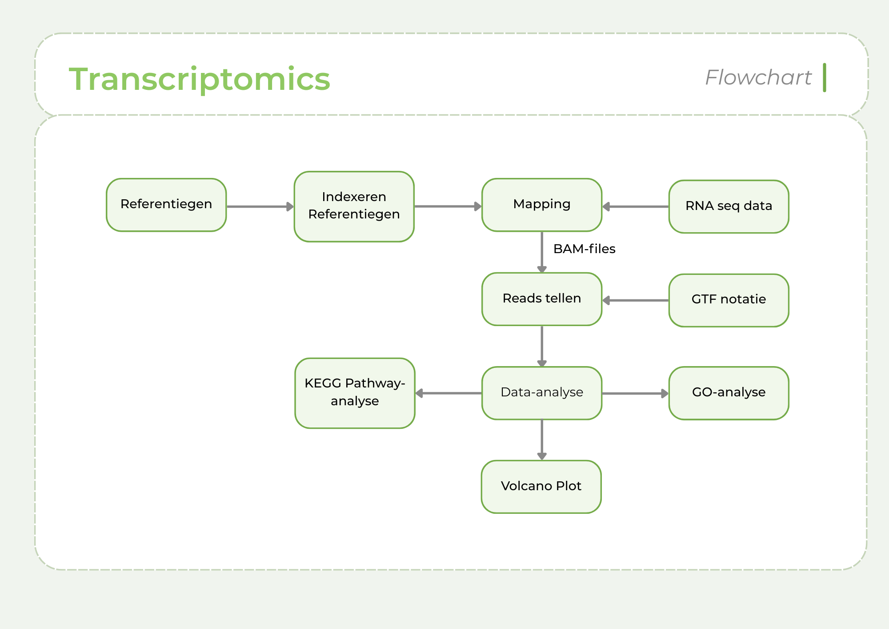
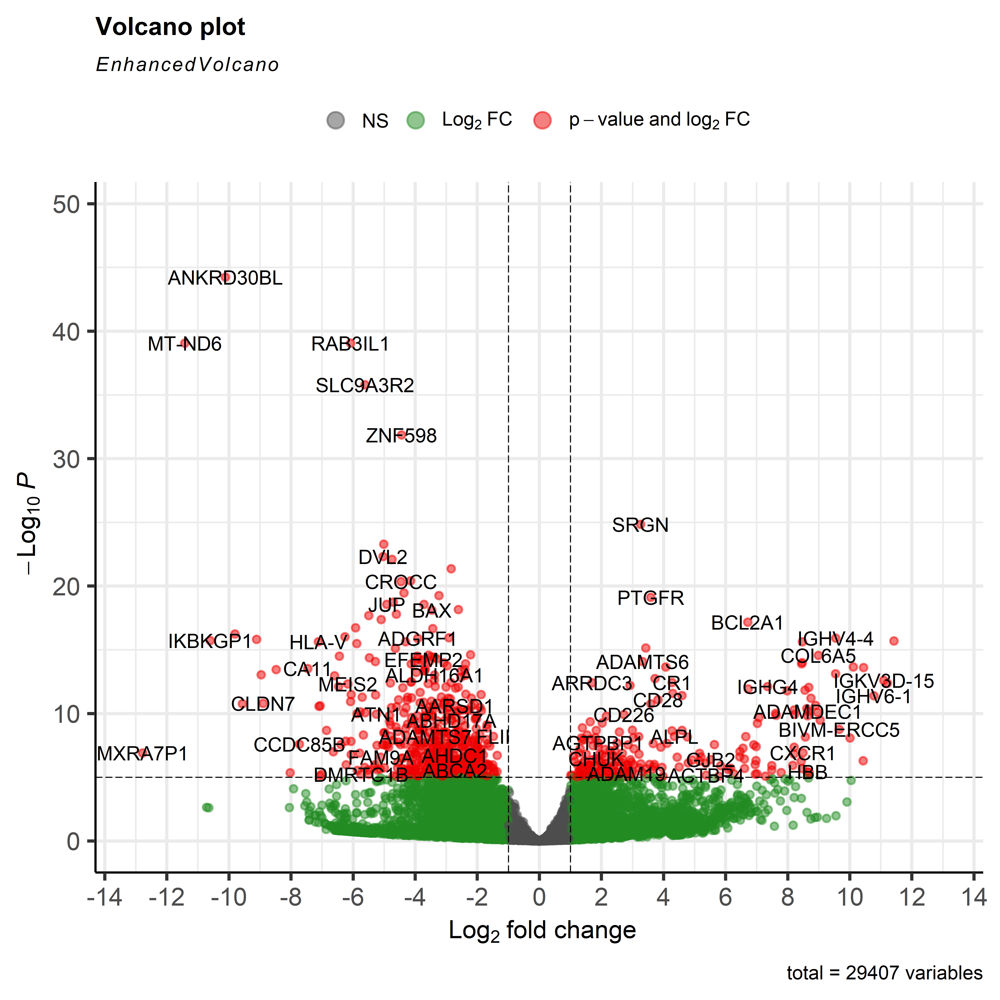
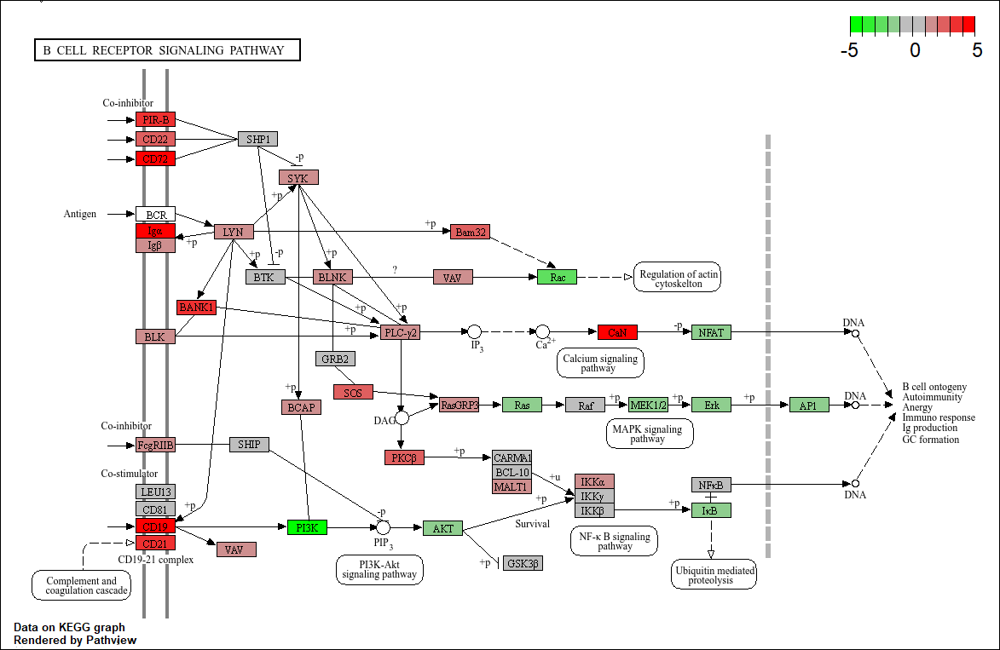

# Calciumsignaling en Osteoclast Differentiation als Drijvende Krachten van Boterosie in Reumatoïde Artritis
## 📁 Inhoud/structuur
- `assets` - Overige documenten voor de opmaak van deze pagina.
- `bronnen` - Gebruikte bronnen en AI gebruik.
- `data processed` – Bewerkte data voor helder overzicht van resultaten en uitvoeren van analyses. 
- `data raw` – Ruwe data afkomstig van 8 individuen, waarvan 4 RA hebben, en 4 gezond zijn.  
- `data_stewardship` - Aantoning van de competentie Beheren niveau I 
- `scripts` – Scripts waarin de data geanalyseerd wordt.
- `resultaten` - Figuren zoals grafieken en tabellen.
- `README.md` - Het document om de tekst hier te genereren.

---

## Inleiding

Reumatoïde artritis (RA) is een veelvoorkomende autoimmuunziekte. In 2024 waren er zo’n 200.000 Nederlanders met deze aandoening [(Reumatoïde artritis (RA) | Leeftijd en geslacht | Volksgezondheid en Zorg, z.d.)](#vzinfo2026). RA wordt gekenmerkt door synoviale hyperplasie met pannusvorming [(Chetina & Markova, 2019)](#chetina2019). Synovium, een type slijmvlies raakt ontstoken, wat lijdt tot de erosie van bot- en kraakbeenweefsel wegens vorming en overname van pannusweefsel [(Gravallese & Monach, 2015)](#gravallese2015). Momenteel focust onderzoek zich op de genen die met T-cellen te maken hebben [(Padyukov, 2022)](#padyukov2022). Er zijn al kleine klinische studies bezig met een mogelijk geneesmiddel, CAR T-celtherapie [(Freeley, 2025)](#freeley2025). 

Transcriptomics is een veelgebruikte studie binnen genetisch en medisch onderzoek. Het transcriptoom, wat hierbij onderzocht wordt, geeft informatie over hoeveelheid expressie in alle genen. Naar het kijken van de functies van genen met hoge expressie, kan een beeld worden geschetst van de basis processen die plaatsvinden bij zieke individuen, in vergelijking met gezonde personen [(Monzó et al., 2025)](#monzó2025)(Monzó et al., 2025)(#monzó2025).

In dit onderzoek wordt een transcriptomics analyse uitgevoerd. De nadruk wordt gelegd op genen waar minder onderzoek naar gedaan is om een dieper begrip te krijgen van alle processen en pathways die betrokken zijn bij RA, met behulp van een VolcanoPlot, GO-analyse en KEGG pathway-analyse.

## Methoden

Er wordt ingezoomd op de transcriptomics van RA, om genen op te sporen met onderzoekspotentie [(figuur 1)](assets/Flowchart_Methode_RA.png). De ruwe sequencing data in FASTQ bestanden is afkomstig van 8 vrouwen, 4 met RA (leeftijden 54-66), vastgesteld voor >12 maanden en positief getest op autoantistoffen ACPA. En een negatief geteste controlegroep van 4 (leeftijden 15-42). De verkregen data is uitgewerkt in R V4.5.2 in dit [script](scripts/script_casus_transcriptomics_RA.R).

Bij data mapping wordt een index gebouwd met [`BiocManager`](<https://bioconductor.org/install/>) V1.30.27/V3.22 package [`Rsubread`](<http:<//bioconductor.org/packages/Rsubread/>) V2.24.0. Hierin worden FASTA bestanden van het RefSeq referentiegenoom [GRCh38.p14](<https://www.ncbi.nlm.nih.gov/datasets/genome/GCF_000001405.40/>) van de NCBI genome database gemaakt. Het alignen tot BAM bestanden is in paired-end. Rsamtools V2.26.0 sorteert en indexeert de BAM files. De Count Matrix en BAM files matrix wordt gemaakt aan de hand van een GTF annotatiebestand, nogmaals het NCBI GRCh38.p14 genoom.

Een VolcanoPlot wordt gemaakt voor genexpressie bepaling. Hiervoor zijn de [`BiocManager`](<https://bioconductor.org/install/>) packages [`DESeq2`](#liu2021) V1.50.2 en [`EnhancedVolcano`](#EnhVol) V1.28.2 nodig. Een DESeq dataset wordt aangemaakt. De VolcanoPlot bevat de log2FoldChange en gecorrigeerde P-waarde <0.05.

Bepalen van verschillende Gene Ontologies gaat via [`goseq`](<http://bioconductor.org/packages/goseq/>) V1.62.0, [`org.Hs.eg.db`](<http://bioconductor.org/packages/org.Hs.eg.db/>) en [`AnnotationDbi`](<http://bioconductor.org/packages/AnnotationDbi/>). Hier wordt een gecorrigeerde P-waarde van <0.05 aangehouden en het hg38 genoom wordt gebruikt.

Pathway analyses vereisen [`clusterProfiler`](<https://doi.org/10.1089/omi.2011.0118>) V4.18.4 [`pathview`](<http://bioconductor.org/packages/pathview/>) V1.50.0, [`KEGGREST`](<http://bioconductor.org/packages/KEGGREST/>) V1.50.0  [`org.Hs.eg.db`](<http://bioconductor.org/packages/org.Hs.eg.db/>) V3.22.0 en [`AnnotationDbi`](<http://bioconductor.org/packages/AnnotationDbi/>) V1.72.0. Een enriched KEGG stelt het juiste organisme vast en de pathview wordt uitgevoerd op het gen van interesse met een log2FoldChange vector.

  

**Figuur 1. Flowchart van de gebruikte methode. Een referentiegenoom wordt geïndexeerd. RNA seq data en Index worden gemapt naar BAM files. De reads van deze files worden samen met de GTF annotatie geteld.**

## 📊 Resultaten

  

**Figuur 2. Volcano plot van de verschillen in gesequencete genen van gezonde individuen (n=4) tegenover RA patienten (n=4). Genen n=29407, p-waarde is meegenomen. De x-range loopt van -14 naar 14, aangezien alle data binnen deze punten ligt. Er is gekozen elke 2 waarden op de x-as aan te geven voor overzicht.**

  

**Figuur 3. KEGG pathway van het hsa04662 gen voor calcium signaling.**
\
KEGG: https://www.kegg.jp/entry/hsa:5737

Bij het inlezen van de GO-analyse was de meest significante data gerelateerd aan de T-cel. Dit was te verwachten wegens een grote focus op dit gebied binnen onderzoek. Echter waren relatief weinig ontologieën ongerelateerd aan immuuncellen en waren sommige ontologieën.

[Gene Ontology](<https://amigo.geneontology.org/amigo/term/GO:0030316>)

## Conclusie

-

-

-

## Bronnen
**NOG NIET OP VOLGORDE**

AnnotationDbi. (z.d.). Bioconductor. Geraadpleegd 29 mei 2026, van <http://bioconductor.org/packages/AnnotationDbi/>

Bioconductor—Install. (z.d.). Geraadpleegd 29 mei 2026, van <https://bioconductor.org/install/>

Boyle, W. J., Simonet, W. S., & Lacey, D. L. (2003). Osteoclast differentiation and activation. Nature, 423(6937), 337-342. <https://doi.org/10.1038/nature01658>

 Chetina, E. V., & Markova, G. A. (2019). Prospects for the Use of Gene Expression Analysis in Rheumatology. Biochemistry (Moscow), Supplement Series B: Biomedical Chemistry, 13(1), 13-25. <https://doi.org/10.1134/S1990750819010049>

EnhancedVolcano. (z.d.). Bioconductor. Geraadpleegd 29 mei 2026, van <http://bioconductor.org/packages/EnhancedVolcano/>

 Freeley, M. (2025). CAR T Cell Therapy for Rheumatoid Arthritis. Clinical Reviews in Allergy & Immunology, 68(1), 100. <https://doi.org/10.1007/s12016-025-09113-7>

Goseq. (z.d.). Bioconductor. Geraadpleegd 29 mei 2026, van <http://bioconductor.org/packages/goseq/>

 Gravallese, E. M., & Monach, P. A. (2015). The rheumatoid joint: Synovitis and tissue destruction. In Rheumatology (pp. 768-784). Mosby. <https://doi.org/10.1016/B978-0-323-09138-1.00094-2>

Homo sapiens genome assembly GRCh38.p14. (z.d.). NCBI. Geraadpleegd 28 mei 2026, van <https://www.ncbi.nlm.nih.gov/datasets/genome/GCF_000001405.40/>

KEGGREST. (z.d.). Bioconductor. Geraadpleegd 29 mei 2026, van <http://bioconductor.org/packages/KEGGREST/>

KEGG T01001: 5737. (z.d.). Geraadpleegd 29 mei 2026, van <https://www.kegg.jp/entry/hsa:5737>

Liu, S., Wang, Z., Zhu, R., Wang, F., Cheng, Y., & Liu, Y. (2021). Three Differential Expression Analysis Methods for RNA Sequencing: Limma, EdgeR, DESeq2. Journal of Visualized Experiments: JoVE, (175). <https://doi.org/10.3791/62528>

 Monzó, C., Liu, T., & Conesa, A. (2025). Transcriptomics in the era of long-read sequencing. Nature Reviews. Genetics, 26(10), 681-701. <https://doi.org/10.1038/s41576-025-00828-z>

Org.Hs.eg.db. (z.d.). Bioconductor. Geraadpleegd 29 mei 2026, van <http://bioconductor.org/packages/org.Hs.eg.db/>

 Padyukov, L. (2022). Genetics of rheumatoid arthritis. Seminars in Immunopathology, 44(1), 47-62. <https://doi.org/10.1007/s00281-022-00912-0>

Pathview. (z.d.). Bioconductor. Geraadpleegd 29 mei 2026, van <http://bioconductor.org/packages/pathview/>

Rsubread. (z.d.). Bioconductor. Geraadpleegd 29 mei 2026, van <http:<//bioconductor.org/packages/Rsubread/>

 Reumatoïde artritis (RA) | Leeftijd en geslacht | Volksgezondheid en Zorg. (z.d.). VZinfo. Geraadpleegd 26 mei 2026, van <https://www.vzinfo.nl/reumatoide-artritis-ra/leeftijd-en-geslacht>

 Yu, G., Wang, L.-G., Han, Y., & He, Q.-Y. (2012). clusterProfiler: An R package for comparing biological themes among gene clusters. Omics: A Journal of Integrative Biology, 16(5), 284-287. <https://doi.org/10.1089/omi.2011.0118>

